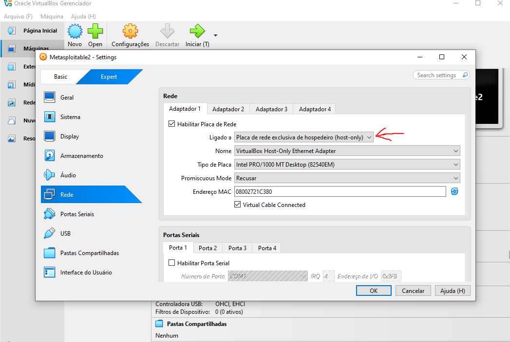
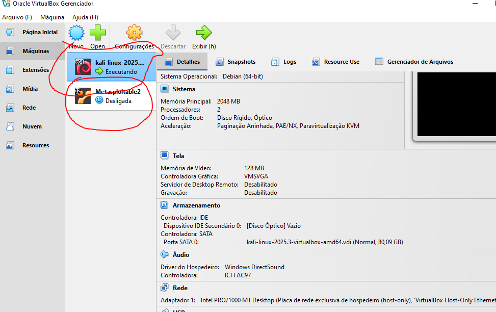
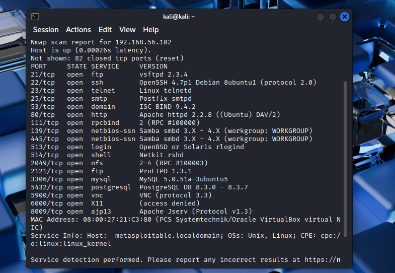
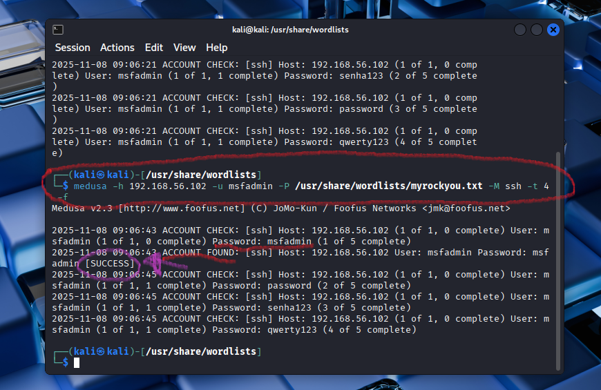

# Laboratório de Análise de Ataques de Força Bruta

⚠️ **AVISO LEGAL**: Este projeto foi desenvolvido em ambiente controlado e isolado usando máquinas virtuais locais. NÃO realize testes de segurança em sistemas sem permissão expressa.

## 🎯 Objetivo
Demonstrar vulnerabilidades relacionadas a ataques de força bruta em ambientes controlados e, principalmente, apresentar medidas efetivas de proteção contra esses ataques.

## 📋 Índice
- [Requisitos](#requisitos)
- [Ambiente de Laboratório](#ambiente-de-laboratório)
- [Demonstração do Ataque](#demonstração-do-ataque)
- [Mitigações e Proteções](#mitigações-e-proteções)
- [Como Reproduzir em Ambiente Seguro](#como-reproduzir-em-ambiente-seguro)

## 🔧 Requisitos
- VirtualBox ou VMware Workstation
- Kali Linux (VM)
- Metasploitable 2 (VM)
- Mínimo 8GB RAM no host
- 40GB espaço em disco

## 🖥️ Ambiente de Laboratório

### Configuração da Rede

### Máquinas Virtuais

## 🔍 Demonstração do Ataque
> ⚠️ **Importante**: Esta seção mostra apenas resultados resumidos. Detalhes específicos de exploração foram omitidos intencionalmente.

### Enumeração Inicial

### Tentativa de Força Bruta

## 🛡️ Mitigações e Proteções

### 1. Bloqueio de IP por Tentativas Múltiplas
- Implementação de Fail2ban
- Configuração de regras no firewall
- Monitoramento de logs de autenticação

### 2. Políticas de Senha Forte
- Mínimo 12 caracteres
- Combinação de maiúsculas, minúsculas, números e símbolos
- Troca periódica de senhas
- Blacklist de senhas comuns

### 3. Implementação de 2FA/MFA
- Autenticação em dois fatores (obrigatório hoje em dia)
- Uso de aplicativos autenticadores
- Tokens físicos de segurança

### 4. Limitação de Taxa (Rate Limiting)
- Implementação no nível de aplicação
- Configuração no WAF
- Monitoramento de tentativas por período

### 5. Logs e Monitoramento
- Centralização de logs
- Alertas em tempo real
- Análise de padrões de ataque

## 🚀 Como Reproduzir em Ambiente Seguro

### Passo 1: Configuração das VMs
Consulte o guia detalhado em [vm-setup/README.md](vm-setup/README.md)

### Passo 2: Configuração da Rede

### Passo 3: Testes e Coleta de Evidências
Consulte o guia em [docs/metodologia.md](docs/metodologia.md)

## 📚 Evidências e Relatórios
- [Relatório Detalhado](docs/relatorio_final.md)
- [Coleção de Evidências](docs/evidencias.md)
- [Guia de Mitigações](docs/mitigacoes.md)

## 🔒 Licença
Este projeto está sob a licença MIT. Veja o arquivo [LICENSE](LICENSE) para mais detalhes.

## ✍️ Autor
Desenvolvido por Michael Alan para o Bootcamp Santander Cibersegurança - DIO.
